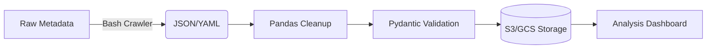

# Build Net

# MetaFlow Automator 📊 [](https://github.com/denezt/build-net/actions) [](https://pypi.org/project/metadata-flow/)

A Linux-first automation toolkit for managing distributed project metadata. Combines bash scripting efficiency with Python data processing power for enterprise-scale metadata operations.

## Features 🚀
- **Distributed Metadata Crawling** - Bash-powered parallel scraping of project metadata
- **Smart Data Processing** - Pandas/Numpy-based analysis pipelines
- **Cloud-Native** - Built-in AWS S3/GCS integration for metadata storage
- **YAML/JSON Schemas** - Type-safe metadata validation with Pydantic models
- **CLI Dashboard** - Rich terminal interface for metadata exploration (using Rich)

## Prerequisites 📋
- **Linux Environment** (Ubuntu 22.04+ recommended)
- Python 3.10+ (`python3 -V`)
- pip 23.0+ (`pip3 --version`)
- Bash 5.1+ (`bash --version`)
- [Optional] Docker CE for containerized processing

## Installation 🛠️
```bash
# Clone with submodules (contains sample metadata schemas)
git clone --recurse-submodules https://github.com/denezt/build-net.git
cd build-net

# Create virtual environment
python3 -m venv .venv
source .venv/bin/activate

# Install with production dependencies
pip3 install -r requirements.txt

# Install CLI tool globally
sudo ln -s $(pwd)/metaflow /usr/local/bin/metaflow
```

## Usage Examples 💻

### Basic Metadata Processing
```bash
# Crawl projects (parallel execution)
metaflow crawl --projects ./projects/*.yaml --workers 8

# Generate analysis report
metaflow analyze --output report.html --format html

# Validate metadata schema
metaflow validate --schema schemas/project_meta.v1.json
```

### Advanced Pipeline
```bash
#!/bin/bash
# process_projects.sh - Parallel metadata ETL pipeline

export AWS_BUCKET="my-metadata-store"
export PYTHONPATH="./src"

find ./projects -name "*.yaml" | parallel -j 4 '''
  python3 -m pipeline.extract {} | \
  python3 -m pipeline.transform | \
  aws s3 cp - "s3://$AWS_BUCKET/processed/$(basename {}).json"
'''
```

## Data Flow Architecture 📈


## Development Setup 🧑💻

### Testing Framework
```bash
# Run unit tests with coverage
pytest --cov=metaflow --cov-report=html

# Static analysis
flake8 src/ --max-complexity 10
mypy src/

# Benchmark metadata processing
python3 -m pytest benchmarks/ -m "perf"
```

### CI/CD Pipeline (.github/workflows/python-ci.yml)
```yaml
jobs:
  analysis:
    runs-on: ubuntu-latest
    steps:
      - uses: actions/checkout@v4
      - name: Set up Python
        uses: actions/setup-python@v4
        with:
          python-version: '3.10'
      - run: pip install -r requirements-dev.txt
      - run: |
          pytest --junitxml=test-results.xml
          flake8 src/ --exit-zero
          mypy src/
      - uses: codecov/codecov-action@v3
```

## Data Schemas 📄
```yaml
# schemas/project_meta.v1.yaml
Project:
  type: object
  required:
    - name
    - dependencies
    - contributors
  properties:
    name:
      type: string
      pattern: "^[A-Z][a-z0-9_-]{3,}$"
    dependencies:
      type: array
      items:
        type: string
    contributors:
      type: array
      items:
        $ref: "#/Contributor"
```

## Contributing 🤝
1. Install dev dependencies: `pip3 install -r requirements-dev.txt`
2. Enable pre-commit hooks: `pre-commit install`
3. Add new metadata schemas to `schemas/` submodule
4. Update integration tests in `tests/e2e/`
5. Document new features in `man/metaflow.1.ronn`

## License 📄
<https://unlicense.org>
