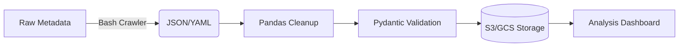

# Build Net

# MetaFlow Automator 📊 [](https://github.com/denezt/build-net/actions) [](https://pypi.org/project/metadata-flow/)

A Linux-first automation toolkit for managing distributed project metadata. Combines bash scripting efficiency with Python data processing power for enterprise-scale metadata operations.

## Features 🚀

* **Distributed Metadata Crawling** - Bash-powered parallel scraping of project metadata
* **Smart Data Processing** - Pandas/Numpy-based analysis pipelines
* **Cloud-Native** - Built-in AWS S3/GCS integration for metadata storage
* **YAML/JSON Schemas** - Type-safe metadata validation with Pydantic models
* **CLI Dashboard** - Rich terminal interface for metadata exploration (using Rich)

## Prerequisites 📋

* **Linux Environment** (Ubuntu 22.04+ recommended)
* Python 3.10+ (`python3 -V`)
* Bash 5.1+ (`bash --version`)
* [Optional] Docker CE for containerized processing

### Install `uv`

`uv` manages virtual environments and installs dependencies quickly.

```bash
# Recommended: install uv (Linux/macOS)
curl -LsSf https://astral.sh/uv/install.sh | sh

# Verify
uv --version
```

> If you already use Homebrew: `brew install uv`

## Installation 🛠️

```bash
# Clone with submodules (contains sample metadata schemas)
git clone --recurse-submodules https://github.com/denezt/build-net.git
cd build-net

# Create a virtual environment (stored in .venv) and sync dependencies
uv venv
uv sync
```

### Install the CLI

If you expose a CLI entrypoint (recommended), prefer `uv run` during development:

```bash
# Run the CLI inside the uv-managed environment
uv run metaflow --help
```

If your repo ships a script named `metaflow` (as shown below) and you still want a global symlink:

```bash
sudo ln -s "$(pwd)/metaflow" /usr/local/bin/metaflow
```

> Tip: If you package this as a proper Python project, add a console script entry and you won’t need a symlink.

## Usage Examples 💻

### Basic Metadata Processing

```bash
# Crawl projects (parallel execution)
uv run metaflow crawl --projects ./projects/*.yaml --workers 8

# Generate analysis report
uv run metaflow analyze --output report.html --format html

# Validate metadata schema
uv run metaflow validate --schema schemas/project_meta.v1.json
```

### Advanced Pipeline

```bash
#!/bin/bash
# process_projects.sh - Parallel metadata ETL pipeline

export AWS_BUCKET="my-metadata-store"
export PYTHONPATH="./src"

find ./projects -name "*.yaml" | parallel -j 4 '''
  uv run python -m pipeline.extract {} | \
  uv run python -m pipeline.transform | \
  aws s3 cp - "s3://$AWS_BUCKET/processed/$(basename {}).json"
'''
```

## Data Flow Architecture 📈



## Development Setup 🧑💻

### Install dev dependencies

This assumes you define dev dependencies in your project (recommended). Typical options:

* **Option A (recommended):** dev dependencies in `pyproject.toml`
* **Option B:** a dev requirements file (e.g., `requirements-dev.txt`)

If you use **Option A**:

```bash
uv sync --dev
```

If you use **Option B**:

```bash
uv pip install -r requirements-dev.txt
```

### Testing Framework

```bash
# Run unit tests with coverage
uv run pytest --cov=metaflow --cov-report=html

# Static analysis
uv run flake8 src/ --max-complexity 10
uv run mypy src/

# Benchmark metadata processing
uv run pytest benchmarks/ -m "perf"
```

## CI/CD Pipeline (.github/workflows/python-ci.yml)

Below is an example switching CI from `pip install -r ...` to `uv`:

```yaml
jobs:
  analysis:
    runs-on: ubuntu-latest
    steps:
      - uses: actions/checkout@v4

      - name: Set up Python
        uses: actions/setup-python@v5
        with:
          python-version: '3.10'

      - name: Install uv
        run: curl -LsSf https://astral.sh/uv/install.sh | sh

      - name: Sync dependencies
        run: |
          uv venv
          uv sync --dev

      - name: Test + Lint
        run: |
          uv run pytest --junitxml=test-results.xml
          uv run flake8 src/ --exit-zero
          uv run mypy src/

      - uses: codecov/codecov-action@v3
```

> If you publish lockfiles, `uv.lock` provides reproducible installs in CI.

## Data Schemas 📄

```yaml
# schemas/project_meta.v1.yaml
Project:
  type: object
  required:
    - name
    - dependencies
    - contributors
  properties:
    name:
      type: string
      pattern: "^[A-Z][a-z0-9_-]{3,}$"
    dependencies:
      type: array
      items:
        type: string
    contributors:
      type: array
      items:
        $ref: "#/Contributor"
```

## Contributing 🤝

1. Create env + install deps: `uv venv && uv sync --dev`
2. Enable pre-commit hooks: `uv run pre-commit install`
3. Add new metadata schemas to `schemas/` submodule
4. Update integration tests in `tests/e2e/`
5. Document new features in `man/metaflow.1.ronn`

## License 📄

[https://unlicense.org](https://unlicense.org)
